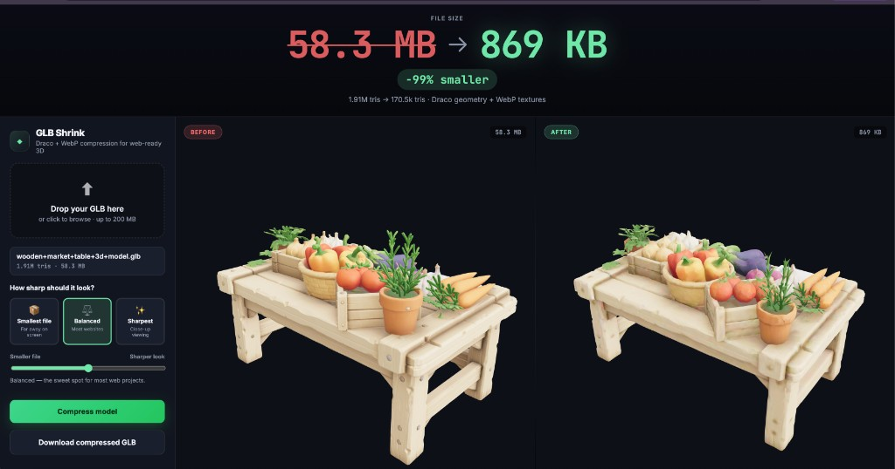

# GLB Shrink

**在线压缩 GLB 3D 模型** — 拖放文件，在 Three.js 中左右对比压缩前后效果，一键下载适用于游戏、应用、AR/VR 或网页的轻量化资源。

实际压缩效果示例：



**58.3 MB → 869 KB · 缩小 99%**  
191 万三角面 → 17 万三角面 · Draco 几何体 + WebP 纹理

---

## 项目简介

AI 生成或扫描得到的 3D 模型，常见体积在 **5–60+ MB**，三角面数量可达数十万甚至上百万。用于离线编辑尚可，但放进实时 3D 项目（游戏、互动应用、AR 体验、网页 3D）往往过重。

GLB Shrink 能在数秒内把臃肿的 GLB 转成**更轻、可直接上线的资源**，并提供实时前后对比预览，所见即所得。

无需 Blender，无需命令行，无需手动调参。

---

## 功能特性

### 拖放、预览、下载

- 拖放任意 `.glb` 文件（无文件大小上限，大文件需足够内存）
- **压缩前 / 压缩后** 双栏 3D 预览，支持轨道旋转
- 一键下载 `-draco.glb` 压缩结果

### 醒目的体积对比

顶部 Hero 区域以大号高对比字体展示文件体积变化，适合录屏演示与分享。压缩完成后自动更新节省比例。

### 简单的质量档位

无需理解三角面比例或几何误差参数，只需选择：

| 选项 | 适用场景 |
|------|----------|
| **最小文件** | 远景道具、背景装饰 |
| **平衡** | 大多数项目（游戏、应用、场景）*（默认）* |
| **最清晰** | 近景观看、主体模型 |

可用 **更小文件 ↔ 更清晰** 滑块在预设间微调，提示文字会随档位实时更新。

### 生产级压缩管线

基于实时 3D 项目常用流程构建：

1. 剥离已有的 meshopt / Draco / 量化扩展
2. 焊接重复顶点（weld）
3. 使用 [MeshoptSimplifier](https://github.com/zeux/meshoptimizer) 简化几何体
4. 重新烘焙平滑法线（避免面片化阴影）
5. 纹理转 **WebP** 并按目标分辨率缩放
6. **Draco 编码**几何体，减小传输体积
7. 输出二进制 GLB

输出包含：

- `KHR_draco_mesh_compression` — 几何体压缩
- `EXT_texture_webp` — WebP 纹理

Three.js、Unity、Unreal Engine、Godot 及多数现代 glTF 运行时均支持。

---

## 快速开始

### 环境要求

- **Node.js 18+**
- macOS、Linux 或 Windows

### 开发模式

```bash
git clone https://gitee.com/zhangyiweb/glb-shrink.git
cd glb-shrink
npm install
npm run dev
```

浏览器打开 **http://localhost:5173**。

Vite 负责前端热更新，并将 `/api` 请求代理到后端压缩服务（端口 **3847**）。

### 生产部署

```bash
npm run build
npm start
```

构建后的前端与 API 由同一 Express 服务提供，默认端口 **3847**，可通过环境变量 `PORT` 修改。

> Windows 下 `npm start` 若因 `NODE_ENV=production` 语法报错，可执行：
>
> ```bash
> $env:NODE_ENV="production"; node server/index.mjs
> ```

---

## 使用说明

1. **拖放 GLB** 到上传区（或点击浏览）
2. 原始模型加载到左侧 **压缩前** 预览，并显示文件大小与三角面数
3. 选择质量预设 — 大多数模型选 **平衡** 即可
4. 点击 **压缩模型**
5. 在右侧 **压缩后** 预览中对比效果
6. 满意后点击 **下载压缩后的 GLB**

### 质量预设参考

| 预设 | 适用场景 | 典型输出 |
|------|----------|----------|
| 最小文件 | 远景道具、批量装饰 | 约 3–5k 三角面，40–80 KB |
| 平衡 | 通用场景（游戏、应用） | 约 5–8k 三角面，60–150 KB |
| 最清晰 | 近景、主体资产 | 约 15–40k 三角面，150–400 KB |

可用滑块在预设之间微调，无需接触底层参数。

---

## 项目结构

```
glb-shrink/
├── docs/
│   └── screenshot.png      # README 演示截图
├── public/
│   └── draco/              # Three.js 预览用的 Draco 解码器
├── server/
│   ├── index.mjs           # Express API（分析 + 压缩）
│   ├── compress.mjs        # 压缩管线
│   ├── inspect.mjs         # 模型统计
│   └── presets.mjs         # 质量预设 → 压缩参数
├── src/
│   ├── main.ts             # Three.js 前端
│   └── style.css
├── index.html
├── package.json
└── vite.config.ts
```

### API 接口

| 方法 | 路径 | 说明 |
|------|------|------|
| `GET` | `/api/health` | 健康检查 |
| `GET` | `/api/presets` | 质量预设列表 |
| `POST` | `/api/inspect` | 上传 GLB → 返回统计（三角面、体积等） |
| `POST` | `/api/compress` | 上传 GLB + `quality`（0–100）→ 返回压缩 GLB |

---

## 技术栈

| 层级 | 技术 |
|------|------|
| 前端 | Vite、TypeScript、CSS（中文界面） |
| 3D 预览 | Three.js、OrbitControls、GLTFLoader、DRACOLoader |
| 压缩 | `@gltf-transform`、meshoptimizer、draco3dgltf、sharp |
| 后端 | Express、multer |

### 预览与 Draco

- 左右预览均通过 `GLTFLoader` + `DRACOLoader` 加载
- **压缩后**模型必定含 Draco，预览时会自动解压
- **压缩前**模型仅在原文件本身已含 Draco 时才会触发解压

---

## 在项目中使用压缩结果

Draco 压缩的 GLB 适用于多数实时 3D 管线。以 **Three.js** 为例：

```javascript
import { GLTFLoader } from 'three/addons/loaders/GLTFLoader.js';
import { DRACOLoader } from 'three/addons/loaders/DRACOLoader.js';

const dracoLoader = new DRACOLoader();
dracoLoader.setDecoderPath('/draco/');

const loader = new GLTFLoader();
loader.setDRACOLoader(dracoLoader);

const gltf = await loader.loadAsync('/models/my-model-draco.glb');
scene.add(gltf.scene);
```

将 `public/draco/` 目录复制到你项目的静态资源路径，确保解码器可访问。

---

## 常见问题

**压缩后模型看起来有棱角 / 面片感**  
管线会自动重烘焙法线。若仍不满意，可尝试 **最清晰** 预设，提高三角面预算。

**颜色异常或模型全黑**  
纹理可能在过激简化中被剥离。请尝试 **平衡** 或 **最清晰**，并确认源 GLB 含有嵌入纹理。

**文件仍然偏大**  
将滑块拉向 **更小文件**，或选择最小文件预设。较低质量会同时降低纹理分辨率与三角面数量。

**浏览器加载压缩 GLB 报 Draco 错误**  
确保已配置 `DRACOLoader`，且 `setDecoderPath('/draco/')` 指向正确的解码器文件。

**上传大文件失败或进程崩溃**  
服务端将整个文件载入内存处理，超大 GLB 需要充足物理内存，建议预留数倍于文件体积的可用内存。

---

## 开源协议

[MIT](LICENSE) — 可自由使用、修改与分发。

---

## 致谢

压缩管线改编自 **ThreeShaders** 项目中的 3D 资产工作流（[@boona13](https://github.com/boona13)）。

基于 [Three.js](https://threejs.org)、[@gltf-transform](https://gltf-transform.dev)、[meshoptimizer](https://github.com/zeux/meshoptimizer) 构建。
